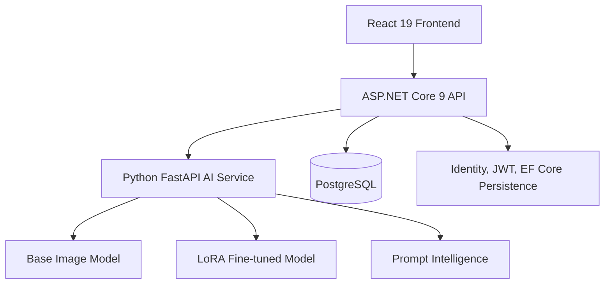

# FoodAds AI

FoodAds AI is a restaurant-focused AI SaaS platform for generating marketing campaigns, food images, ad copy, captions, hashtags, and promotional content.

This repository now contains a working monorepo scaffold with:

- `frontend/` for the React 19 customer experience
- `backend/` for the ASP.NET Core API and business logic
- `python-ai-service/` for FastAPI-based AI orchestration
- `database/` for schema and migration planning
- `docs/` for architecture, API, and implementation notes
- `docker/` for local development orchestration

The existing notebook and adapter artifacts are preserved as the source of truth for the current image-generation workflow:

- `Food Image Generation-SD+LoRA.ipynb`
- `adapter_config.json`
- `adapter_model.safetensors`

## Target Architecture

## What the scaffold covers

- Prompt enhancement before image generation
- Base and LoRA AI service boundaries with prompt/copy generation
- Clean Architecture backend layout
- A working ASP.NET Core API host
- A working React 19/Vite frontend shell
- PostgreSQL + EF Core persistence with a code-first migration
- Docker-friendly local development setup

## Verified locally

- `dotnet build backend/FoodAdsAI.sln`
- `npm run build` in `frontend/`

## Next steps

1. Apply the EF Core migrations to a PostgreSQL instance.
2. Start the backend, frontend, and Python AI service together with production environment variables.
3. Add integration tests for authenticated campaign, image-generation, and history flows.
# FoodAds-Ai
