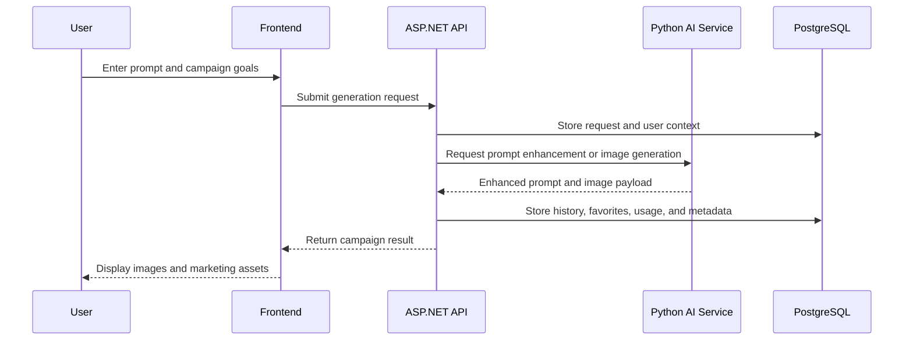

# FoodAds AI Architecture

## Overview

FoodAds AI is designed as a three-tier SaaS system:

1. React 19 frontend for restaurant users and admins
2. ASP.NET Core 9 API for authentication, domain logic, and data access
3. Python FastAPI AI service for prompt enhancement and image generation

The system is intentionally split so the model-heavy Python workload stays isolated from the application and database layers.

## Core Principles

- Keep model loading in Python, not C#
- Load large models once during service startup
- Keep the ASP.NET API as the system of record
- Use PostgreSQL for durable business data
- Treat image generation as an AI capability, not a UI concern

## Technology Stack

### Frontend

- React 19
- TypeScript
- Vite
- Tailwind CSS
- shadcn/ui
- Framer Motion
- React Router
- TanStack Query
- Axios
- React Hook Form
- Zod
- Recharts
- Lucide or Heroicons

### Backend

- ASP.NET Core 9 Web API
- Clean Architecture
- Entity Framework Core
- JWT authentication
- ASP.NET Identity
- Swagger/OpenAPI
- AutoMapper
- FluentValidation
- Serilog
- Background Services
- API Versioning
- Rate Limiting
- Health Checks

### AI Service

- FastAPI
- Pydantic Settings
- Groq client for prompt intelligence
- Diffusers / PEFT for image model orchestration
- PIL for development-time fallbacks

### Database

- PostgreSQL
- Code-first migrations
- Soft delete
- Audit fields
- Seed data
- Optimized indexes

## Service Responsibilities

### React Frontend

- Authentication screens
- Prompt and campaign generation UI
- History and favorites views
- Analytics dashboards
- Restaurant profile management

### ASP.NET Core API

- User authentication and authorization
- JWT and refresh token lifecycle
- Restaurant, campaign, and billing workflows
- History, favorites, and usage tracking
- File metadata and business analytics
- API gateway-like orchestration to the AI service

### Python AI Service

- Load the base image generation model once
- Load the LoRA fine-tuned model once
- Provide prompt enhancement
- Provide campaign copy generation
- Return generated image payloads
- Keep LLM and diffusion dependencies isolated

## Notebook To Service Mapping

The notebook currently demonstrates three useful behaviors:

- Base image generation with `stablediffusionapi/realistic-vision-v51`
- LoRA-adapted generation for food-specific results
- Groq-powered prompt enhancement

Those behaviors map to the following service responsibilities:

- `base` model pipeline for general generation
- `lora` pipeline for restaurant-specific output
- `grok` or LLM-backed text generation for prompt and campaign enrichment

## Request Flow



## Database Domain

Planned tables:

- Users
- Roles
- Restaurants
- Campaigns
- GeneratedImages
- PromptHistory
- Favorites
- Subscriptions
- APIUsage
- Notifications

## Deployment Shape

- `frontend`: static SPA or edge-hosted build
- `backend`: ASP.NET Core container
- `python-ai-service`: FastAPI container with GPU-aware deployment
- `postgres`: primary database
- `pgadmin`: local database management

## Recommended Repo Layout

```text
FoodAdsAI/
  frontend/
  backend/
  python-ai-service/
  database/
  docs/
  docker/
```

## Implementation Notes

- Keep AI model weights out of the backend solution
- Use environment variables for all secrets
- Use the backend as the auth boundary
- Prefer async boundaries between the API and AI service
- Persist generation metadata even when image generation falls back to a placeholder image during development
